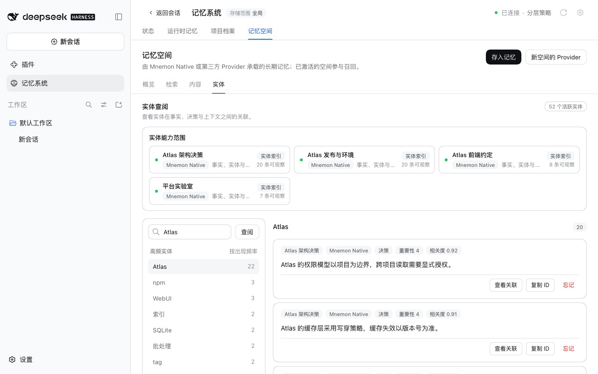
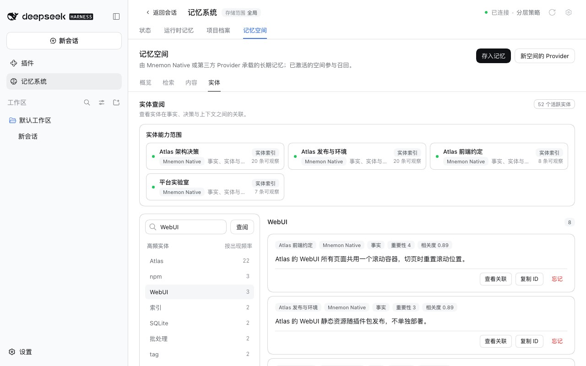
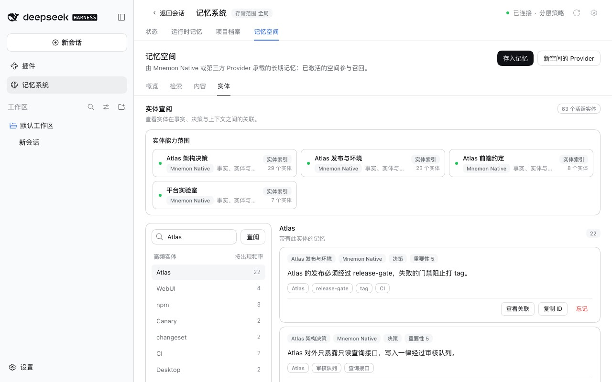
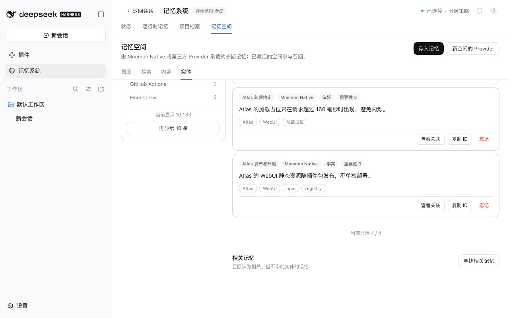
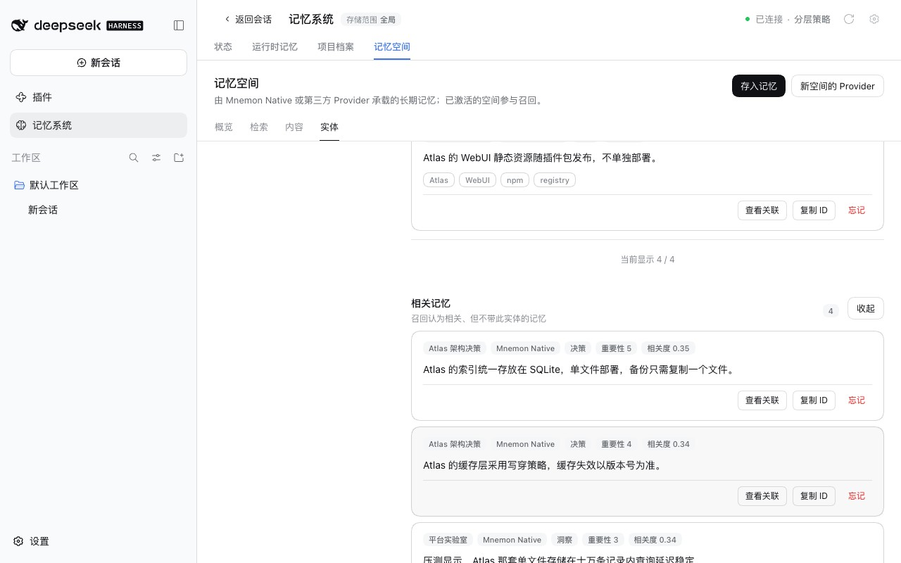

# 实体页：计数与列表都来自全部记忆

**简体中文** | [English](./README.md) | [验证数据](./verification.json)

在**记忆系统 → 记忆空间 → 实体**中，实体旁的数字与选中后列出的内容对不上。报告所用的导出数据里，`dsh-mnemon` 计数 22、只列出 5 条，`UI` 计数 5、却列出 9 条。两个数字来自不同的读取：
- **左侧列表**把每个空间 `mnemon status` 返回的前 20 个实体相加。实体不在某个空间的前 20 名时，会丢掉该空间的计数，甚至整个消失：这份导出共有 129 个不同实体，左侧只显示 62 个。
- **选中实体**走的是给 Agent 用的召回（`intent: ENTITY`）及严格质量策略：0.6 分以上的结果全部保留，0.25–0.6 分之间最多保留四条。召回给大多数 `dsh-mnemon` 记忆打了 0.5 分左右，于是 22 条中有 17 条被截掉；对 `UI`，空出的名额被不带它的记忆补上。

基线：`main` `2729237a`，即已发布的 dsh-mnemon 0.5.23。修复：`a0ded7ec`。运行时间为 2026-10-04（北京时间）：
- macOS 15.6 arm64、Node 24.19.0 与 Mnemon CLI 0.2.9；
- 无头 Chrome 154，1280×800，zh-CN，浅色；
- 仓库自带的一次性 WebUI 测试环境，分别运行在 DSH 0.2.0-rc.2 与 0.1.7-rc.2 上。

全程不调用模型，截图中的记忆均为合成数据。

## 复现

四个围绕虚构项目的 Native 空间，实体均显式指定：
- `Atlas` 由三个空间中的 22 条记忆带有；
- `WebUI` 由 4 条记忆带有，其中一条所在的空间有 23 个实体，它排在前 20 名之外；
- 平台实验室有三条记忆在正文中提到 Atlas，但不带该实体。

| 修复前：Atlas | 修复前：WebUI |
|---|---|
|  |  |

每个空间都显示“20 条可观察”，左侧只有 63 个实体中的 52 个。选中 `Atlas` 列出 20 条：召回上限截掉了两条带有它的记忆，三条只是提到它的记忆补了进来。`WebUI` 计数 3，却列出 8 条。

## 修复

- **每个空间一个索引。** Source 用 Provider 列出的记忆为每个空间建立实体索引，实体的计数就是带有它的记忆数，左侧包含全部实体。不同写法按概览图谱原有的键合并，每条记忆只计一次。两处现在共用同一个键，因此图谱与左侧列表一致。
- **选中后列出这些记忆。** 带有该实体的记忆全部列出，按重要性排序，每次显示六条，展开到已读取的末尾时再读取下一页。
- **相关记忆按需查找。** 列表下方的**查找相关记忆**会针对该实体执行召回。带有该实体的记忆在质量策略挑选之前就被排除，不会占用它的名额。召回是最慢的一步，每个空间约 0.5 秒，因此默认折叠，需要时才运行。展开后，在本次浏览器会话中切换到其他实体时保持展开，直到收起为止。收起后再展开，直接显示已找到的结果，不再重新召回。用户输入的名称没有任何记忆带有时，相关记忆会自动显示，因为这时页面只能提供它们。
- **逐步加载。** 点击实体后立即高亮，并直接用左侧计数显示数量；带有该实体的记忆从索引读取。读取超过 160 毫秒才显示占位。各空间在索引读取期间先按目录显示，对较早选择的迟到响应会被丢弃。
- **数据新鲜度。** 空间的 Provider 统计不变时沿用其索引；Mnemon 的操作日志记录每一次写入。经 Source 写入会立即使索引失效。左侧列表每次都重新检查各空间，选中实体时在十秒内沿用这次检查。同一页面改选其他实体时，会取消仍在等待的相关召回。Mnemon 对同一数据目录逐个执行 CLI 调用，这样新选择不必排在旧召回之后。
- **Provider。** `list()` 取不全整个空间或不能列举的 Provider，可以实现可选的 `entityIndex(body)`，返回 `{ memories, complete }`，索引不完整时会标为部分。两者都没有的实体 Provider 显示为仅查询，只贡献相关记忆。第一方 Provider 无需改动：Mnemon Native 会列出整个 Store，Holographic 与 Hindsight 最多列出 1,000 条记忆。

| 修复后：Atlas | 修复后：相关记忆折叠 | 修复后：查找到的相关记忆 |
|---|---|---|
|  |  |  |

两个宿主上的结果相同：

| | 修复前 | 修复后 |
|---|---|---|
| 左侧实体数 | 52，各空间“20 条可观察” | 63，各空间各自的实体数（29、23、8、7） |
| Atlas：计数 / 列出 | 22 / 20，其中 3 条不带该实体 | 22 / 22；相关记忆折叠，未运行召回 |
| WebUI：计数 / 列出 | 3 / 8 | 4 / 4；**查找相关记忆**在 0.7–0.8 秒后显示 4 条 |
| 展开相关记忆后选中下一个实体 | — | Atlas 自动加载其 5 条相关记忆 |
| 点击后第一张卡片出现 | 400–1,891 毫秒 | 91–99 毫秒 |
| 连续快速切换实体 | 停在第二个 | 停在第二个 |

控制台没有错误。

## 规模

四个合成 Native 空间，每个 500 条记忆，共 139 个实体，经真实的 Source 与 Mnemon Native Provider 读取，Mnemon 0.2.9，取三次点击的中位数：

| | 修复前 | 修复后 |
|---|---|---|
| 左侧列表，首次 / 再次 | 94 / 79 毫秒，24 个实体 | 158 / 92 毫秒，139 个实体 |
| `Release`，855 条带有 | 1,718 毫秒后显示 20 条 | 7 毫秒后显示全部 855 条（分页）；查找相关记忆 1.8 秒 |
| `Atlas`，211 条带有 | 1,608 毫秒后显示 20 条 | 7 毫秒后显示全部 211 条；查找相关记忆 1.5 秒 |
| `Component010`，86 条带有 | 1,547 毫秒后显示 20 条 | 10 毫秒后显示全部 86 条；查找相关记忆 1.7 秒 |
| 相关记忆展开时，选中 `Atlas`，0.3 秒后改选 `Component010` | — | 第二个列表 2 毫秒；第一次相关召回被取消；相关记忆 1.3 秒 |

左侧列表现在会把每个空间读取一次，首次打开约多 60 毫秒。召回每个空间约 0.5 秒，只在**查找相关记忆**时运行；上表中的相关记忆耗时是直接经 Source 读取的结果。

## 报告所用的导出数据

同一构建，在那份导出数据的副本上运行（4 个激活的 Native 空间，31 条记忆；本记录只含计数，不含任何记忆内容）：
- 左侧有 126 个实体，而不是 62 个，每个计数都与概览图谱一致；
- `dsh-mnemon` 计数 22、列出 22 条；**查找相关记忆**另找到 4 条；
- `UI` 计数 6 而不是 5：某个空间的前 20 名漏掉了它。它列出 6 条；**查找相关记忆**另找到 4 条。

## 测试

- 记忆空间：实体索引（写法合并、按记忆计数、排序），列出带有实体的全部记忆且与计数一致，相关记忆不含带有实体的记忆，左侧列表与选中同时发生时每个空间只读一次状态与列表，统计变化或经 Source 写入后重建索引，选中时十秒内沿用检查，按页面视图取消相关召回，Provider `entityIndex` 标为部分，不可用的空间，输入上限；页面上覆盖带有实体的列表与只在需要时查找的相关记忆、展开状态延续到下一个实体直到收起、名称无记忆带有时自动显示相关记忆、删除的记忆立即移除而其余记忆保留到刷新结果替换、先按目录显示空间、丢弃迟到的响应、分页、只在读取较慢时显示占位，以及重试相关记忆时保留已显示的列表。
- 仓库根目录：经审核的展示基线纳入新的实体样式与文案。
